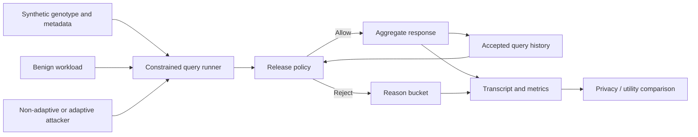
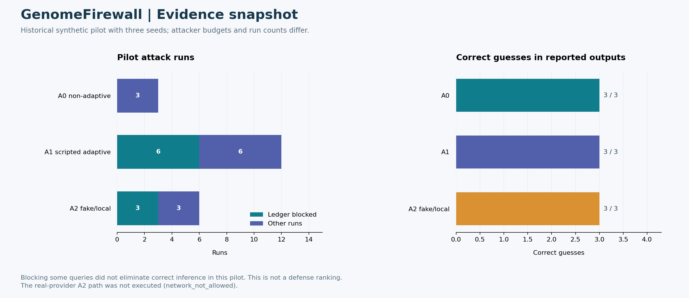

# GenomeFirewall

**반복적인 유전체 집계 질의의 추론 공격과 상태 기반 Privacy Ledger 방어를 평가하는 연구**

> Stateful privacy defenses against inference from repeated genomic aggregate queries.

GenomeFirewall은 단일 질의의 표본 수가 충분하더라도 여러 응답을 조합하면 개인의 유전체 정보가 추론될 수 있다는 문제를 다룬다. 합성 genotype과 metadata, 공격자 전략, 정상 질의 workload, 공개 정책을 같은 실험 틀에 두고 개인정보 보호와 분석 효용의 균형을 비교한다.

| 항목 | 내용 |
|---|---|
| 연구 대상 | Genomic aggregate query systems |
| 위협 | 질의 간 차이와 적응적 질의 선택을 이용하는 inference |
| 방어 | Minimum-cohort policy, stateful Privacy Ledger |
| 평가 환경 | 합성 데이터, scripted attacker, fake/local LLM adapter |
| 구현 | Python 기반 질의·정책·공격·기록·평가 모듈 |

## 1. 왜 질의 이력이 필요한가?

예를 들어 거의 같은 사람들로 구성된 두 cohort에 대해 allele count를 반환하면, 응답의 차이가 제외된 사람의 기여를 드러낼 수 있다. 각 cohort가 최소 표본 수를 만족하더라도 두 집합 사이의 차이는 매우 작을 수 있다.

따라서 검사 대상은 현재 질의의 크기뿐 아니라 과거에 공개한 질의와의 관계까지 포함해야 한다. 이 프로젝트는 이 관계를 상태로 보관하는 정책을 구현하고 다음 질문을 평가한다.

- 고정된 최소 cohort 크기만 검사할 때 어떤 공격이 가능한가?
- 집합 차이·대칭차이 조건을 추가하면 어떤 질의가 차단되는가?
- 정상 분석 질의도 차단되는 경우 효용 손실은 얼마나 되는가?
- 공격자가 이전 응답에 따라 다음 질의를 바꾸면 결과가 달라지는가?
- LLM adapter가 실제로 외부 provider를 호출했는지, local 대체 경로였는지 구분할 수 있는가?

## 2. 시스템 구조



Runner, policy, attacker, logging을 분리했다. 동일한 질의 workload를 다른 정책에 적용하거나, 정책을 고정하고 공격 전략을 바꿀 수 있다. 실행 결과는 transcript로 저장해 질의 수·공개 여부·차단 사유·추론 결과를 다시 집계할 수 있다.

## 3. 질의와 정책

### 지원하는 집계 연산

| 연산 | 의미 |
|---|---|
| `COHORT_COUNT` | 조건에 해당하는 cohort의 인원 수 |
| `ALLELE_COUNT` | 해당 variant의 allele 기여 합계 |
| `CARRIER_COUNT` | 해당 variant의 carrier 수 |

### 비교 정책

| 정책 | 검사 내용 | 의미 |
|---|---|---|
| No privacy policy | 제한 없이 응답 | 비교 기준 |
| Minimum cohort | 현재 cohort 크기와 `k_min` 비교 | 단일 질의 기준의 공개 제한 |
| Stateful Privacy Ledger | 현재 cohort와 과거 허용 질의의 차이·대칭차이 검사 | 질의 조합에 대한 추가 제한 |

Ledger에는 허용된 질의의 index, operator, variant, cohort와 관련 기록을 보관한다. `difference_min`, `symmetric_difference_min`으로 작은 집합 차이를 차단할 수 있으며, 비교 대상을 같은 variant·operator로 제한하는 설정도 있다. 구체적인 결정 로직은 [policies.py](src/genomefirewall/policies.py)에 있다.

## 4. 공격자와 정상 workload

| 공격자 | 역할 | 근거 수준 |
|---|---|---|
| A0 non-adaptive | 미리 정해진 질의 조합 | 실행 가능한 기준 공격 |
| A1 scripted adaptive | 이전 응답에 따라 후보 질의 선택 | Scripted 적응형 비교 |
| A2 fake/local LLM adaptive | LLM 인터페이스와 feedback 경계 점검 | Local/fake provider 실험 |
| A2 guarded real-provider | 외부 provider와 연결하는 제한된 경로 | 실제 호출 허용·실행 여부를 별도로 기록 |

정상 workload에는 benign 및 near-overlap 조건이 포함된다. 공격 차단률만 최적화하면 유용한 분석까지 막을 수 있으므로, 허용·거부된 정상 질의도 함께 살핀다. [합성 평가 명세](docs/experiments/synthetic_evaluation_spec.md), [LLM feedback 경계](docs/experiments/a2_feedback_boundary.md)

## 5. 기록된 pilot 결과

공개된 비교 보고서에는 다음 실행 상태가 기록되어 있다.

| 공격자 경로 | Seeds | Attack runs | Ledger-blocked runs | 실행 상태 |
|---|---:|---:|---:|---|
| A0 non-adaptive | 3 | 3 | 0 | completed |
| A1 scripted adaptive | 3 | 12 | 6 | completed |
| A2 fake/local | 3 | 6 | 3 | completed, network false |
| A2 real-provider 경로 | 0 | 0 | 0 | network_not_allowed |

이 표는 서로 다른 경로의 실행 요약이며, 같은 공격 예산을 사용한 최종 방어 성능 순위표가 아니다. 원 보고서에는 공격을 가능하게 한 run, query pair, 올바른 추론 수 등이 따로 있으며, 실행된 경로의 correct guesses는 각각 **3/3**으로 기록되어 있다. 일부 질의 차단이 전체 정보 노출 방지를 의미하지 않는다는 점을 함께 읽어야 한다. [전체 표](docs/experiments/a0_a1_a2_comparison_report.md)

실제 외부 LLM 경로는 해당 기록에서 실행되지 않았다. 따라서 fake/local 결과를 실제 LLM의 공격 성능이나 실제 provider 비용으로 설명하지 않는다.

## 6. 설치와 최소 실행

**Python 3.11+**를 사용한다. 핵심 합성 평가 경로는 Python standard library로 구성된다.

```bash
git clone https://github.com/CHOMINWOO1/GenomeFirewall.git
cd GenomeFirewall
python -m venv .venv
```

가상환경 활성화 후:

```bash
python -m pip install -e .
python -m unittest discover -s tests -v
python -m genomefirewall.experiments.pilot --output outputs/pilot_transcript.jsonl
python -m genomefirewall.experiments.summarize --input outputs/pilot_transcript.jsonl --output outputs/pilot_summary.json
```

첫 명령군은 작은 pilot transcript를 생성하고 그 내용을 집계한다. `outputs/`는 로컬 실행 산출물 디렉터리이며 Git에서 제외된다.

## 7. 반복 및 threshold 실험

```bash
python -m genomefirewall.experiments.matrix --output outputs/pilot_matrix_summary.json --seed-count 5
python -m genomefirewall.experiments.sweep --help
```

Matrix와 sweep을 사용하면 seed 및 policy threshold 조건을 바꿔 평가할 수 있다. 설정을 바꿀 때는 공격자, 정상 workload, target 수와 질의 예산도 함께 기록해야 비교의 의미가 유지된다. 실행 횟수를 늘리는 것만으로 실제 데이터나 실제 LLM에 대한 검증을 대신할 수는 없다.

## 8. 코드 구조

| 위치 | 역할 |
|---|---|
| [synthetic.py](src/genomefirewall/synthetic.py) | 합성 genotype·metadata |
| [policies.py](src/genomefirewall/policies.py) | 공개 정책과 stateful ledger |
| [attackers.py](src/genomefirewall/attackers.py) | Scripted 공격 전략 |
| [llm_attackers.py](src/genomefirewall/llm_attackers.py) | LLM 기반 공격 인터페이스 |
| [runner.py](src/genomefirewall/runner.py) | 질의와 정책 실행 |
| [query_log.py](src/genomefirewall/query_log.py) | Transcript schema와 기록 |
| [experiments/](src/genomefirewall/experiments/) | Pilot, matrix, sweep, 보고서 생성 |

## 9. 검증과 한계

공개본의 **89개 테스트가 통과**했고 synthetic pilot CLI를 실행했다. 이는 실제 provider 기반 공격이나 암호 backend의 존재를 확인한 결과가 아니다. HE sanity 경로는 backend가 없으면 해당 상태를 명시해야 하며, plaintext fallback을 encrypted evaluation으로 표시하지 않는다.

현재 데이터는 합성이고 공격자 전략과 정책 조건은 제한적이다. Ledger의 특정 집합 규칙은 완전한 개인정보 보호 증명이나 differential privacy 보장을 제공하지 않는다. 실데이터·다양한 적응형 공격·정상 분석 workload에서의 추가 평가가 필요하다.

이 프로젝트에서 확인할 수 있는 작업은 threat model을 실행 가능한 질의·공격·방어로 분해하고, 공격 성공과 분석 효용을 같은 로그에서 비교하며, 실행하지 못한 경로까지 명시적으로 기록한 평가 구조다.


## 시각화된 결과와 진행 상태



[상세 결과·진행 상태·보완 과제·보안 범위](docs/portfolio-results/README.md)에서 근거 자료와 재현 코드를 확인할 수 있다.

## 공개 범위와 추가 문서

이 저장소는 원래 작업 폴더에서 핵심 코드·테스트·설정·작은 예제·대표 결과를 선별한 공개본이다. 대용량 데이터·가중치, 인증정보, 내부 실행 기록과 중복 문서 생성 산출물은 제외했다. 기존 논문·실험 수치는 기록된 결과이며 이번 README 개정에서 재측정하지 않았다.

- [실행한 검증과 한계](VALIDATION.md)
- [공개본 구성과 재사용 조건](PUBLICATION_NOTES.md)
- [인증정보와 로컬 설정 관리](SECURITY.md)

초기 공개본에는 별도 오픈소스 재사용 라이선스를 부여하지 않았다. 제3자 모델·데이터·의존성은 각 원 출처의 이용 조건을 따른다.
